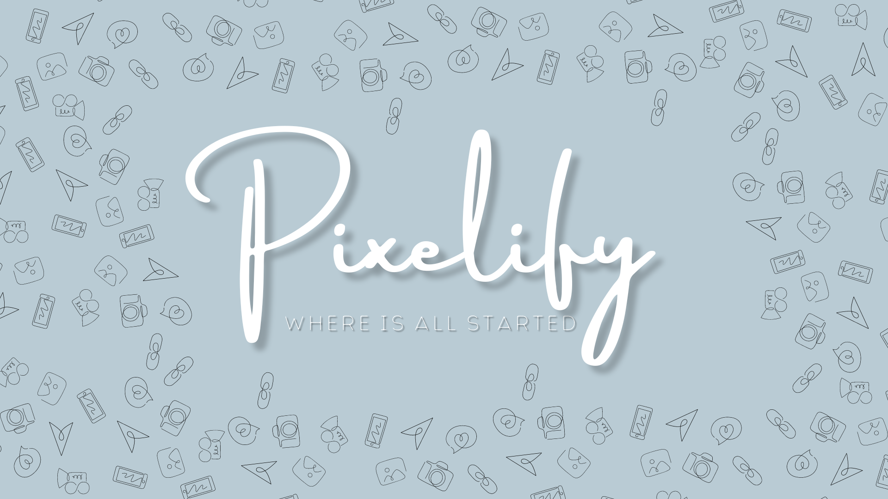

    

        

Project made while learning React, Sanity, NextJS, TailwindCSS.

## Introduction

- A image sharing app.
- It is inspired from Pinterest

## Tech Stack Used

- Tailwind CSS: For Styling
- React: For Front End Developement
- Sanity: For Backend and DataBase Developement
- NVIM: Developement
- Git & Github: Version Control
- Netlify: Hosting Services
- React Icons: Icons
- Javascript, HTML, CSS: Languages

[website]: https://pixelify.netlify.app
